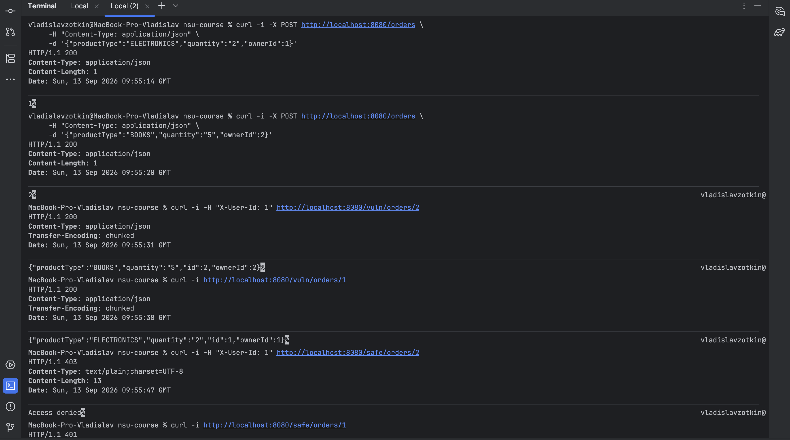

Уязвимость IDOR 

IDOR (Insecure Direct Object Reference) — небезопасная прямая ссылка
на объект. Уязвимость возникает, когда приложение отдаёт объект по
прямому идентификатору (id в URL), не проверяя, имеет ли
запрашивающий право на этот объект.

Метод читает заказ по id из URL и возвращает его клиенту. Заголовок X-User-Id (кто запрашивает) читается, но не используется —
проверки владельца нет.

Проверка, что приложение работает: curl -i http://localhost:8080/health

Создание заказа для пользователя 1:

curl -i -X POST http://localhost:8080/orders \
     -H "Content-Type: application/json" \
     -d '{"productType":"ELECTRONICS","quantity":"2","ownerId":1}'

Создание заказа для пользователя 2:

curl -i -X POST http://localhost:8080/orders \
     -H "Content-Type: application/json" \
     -d '{"productType":"BOOKS","quantity":"5","ownerId":2}'

Эксплуатация уязвимости.
Пользователь 1 читает чужой заказ пользователя 2: curl -i -H "X-User-Id: 1" http://localhost:8080/vuln/orders/2

Дополнительно: запрос без заголовка X-User-Id

curl -i http://localhost:8080/vuln/orders/1

Исправление:

В OrderController.java добавлен защищённый эндпоинт
GET /safe/orders/{id} с двумя проверками:

1. Требование идентификации — если заголовок X-User-Id
   отсутствует, вернуть 401 Unauthorized.
2. Проверка владельца — если userId не совпадает с
   order.getOwnerId(), вернуть 403 Forbidden.

Проверка исправления: curl -i -H "X-User-Id: 1" http://localhost:8080/safe/orders/2

Без заголовка: curl -i http://localhost:8080/safe/orders/1

Запуск приложения

./gradlew bootRun:

Приложение стартует на http://localhost:8080

